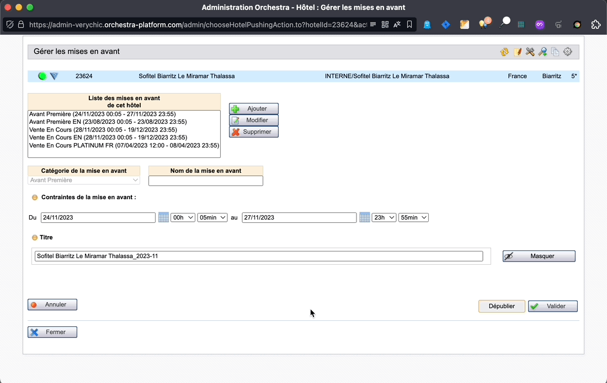

# Orchestra Helper

This is a web browser extension made exclusively for the VeryChic company internal usage.
Its purpose is to provide additional helpful actions on the Orchestra's backoffice web pages.

Features:
 * On the pushings page, provide a shortcut button to unpublish an active pushing: reduce by 1 year the dates and make sure the campaign id didn't change.



## How to install the extension?

This extension is not published on the Chrome Web Store, since it's only for internal usage.

Instead, you have to:
 * download file [`extension.crx`](./extension.crx).
 * go to [chrome://extensions/](chrome://extensions/)
 * then drag and drop the file.

Congratulations! The extension is installed :)

## Usage

### Development

```bash
yarn dev
```

Then **load extension in browser with the `extension/` folder**.

For Firefox developers, you can run the following command instead:

```bash
yarn start:firefox
```

`web-ext` auto reload the extension when `extension/` files changed.

> While Vite handles HMR automatically in the most of the case, [Extensions Reloader](https://chrome.google.com/webstore/detail/fimgfedafeadlieiabdeeaodndnlbhid) is still recommanded for cleaner hard reloading.

### Build

To build the extension, run

```bash
yarn build
```

And then pack files under `extension`, you can upload `extension.crx` or `extension.xpi` to appropriate extension store.
